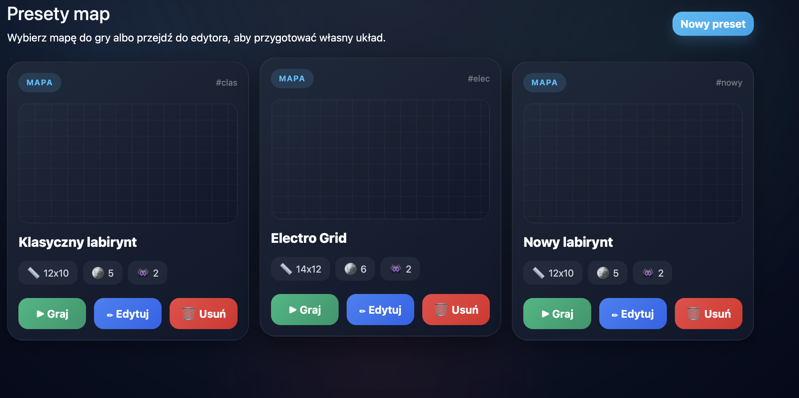
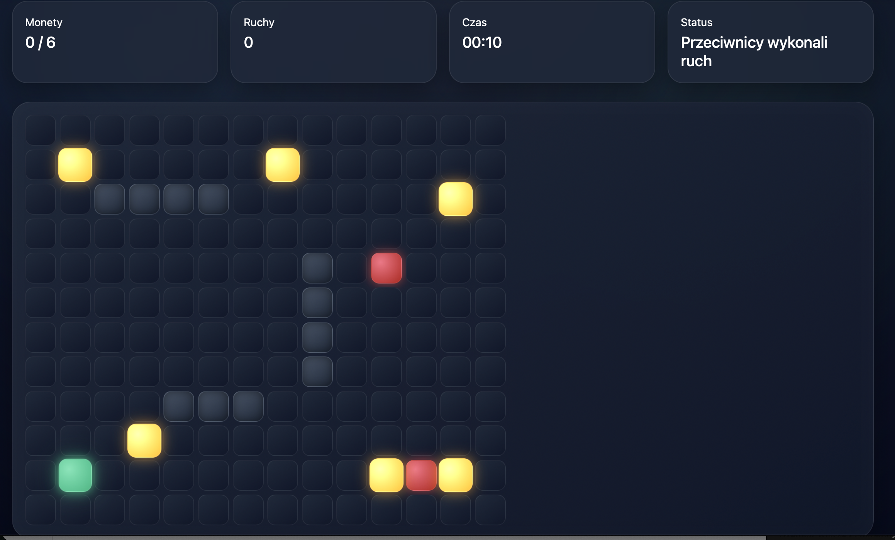
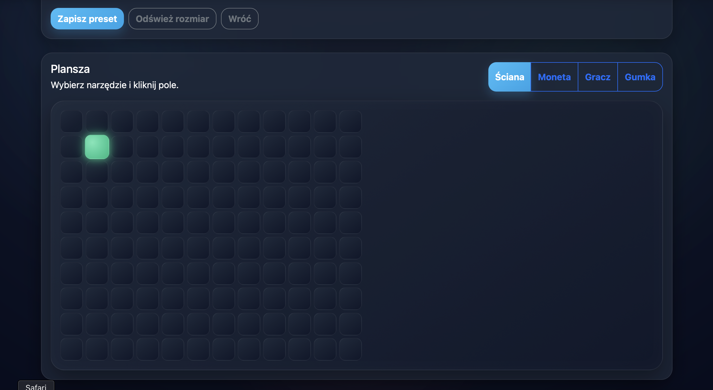
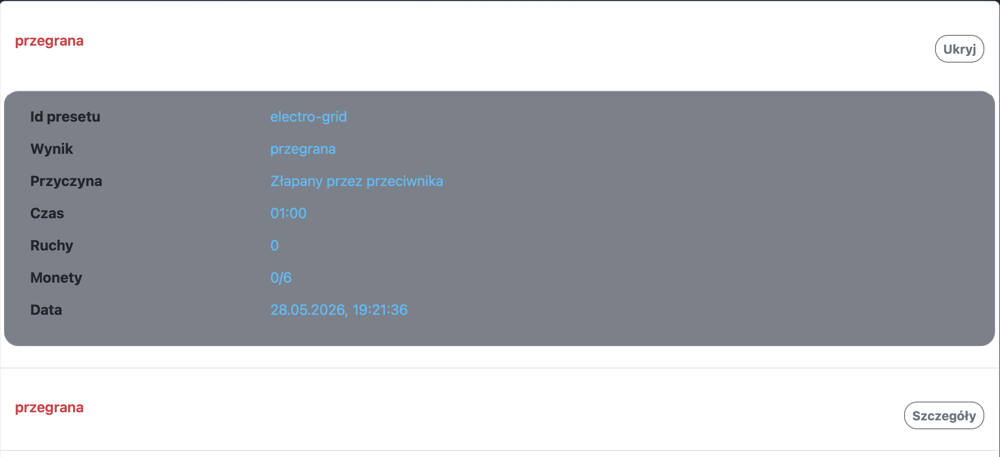

# Gra z Przeciwnikami

Projekt JavaScript: gra labiryntowa z graczem, monetami, przeciwnikami oraz systemem presetów map.

## Temat

Projekt 5 - Gra z Przeciwnikami.

## Opis aplikacji

Aplikacja pozwala wybrać preset mapy, rozegrać partię, zbierać monety i unikać przeciwników. Gracz porusza się po siatce, a przeciwnicy mają różne zachowania:

1. `normal` - ściga gracza.
2. `lava` - zostawia ślady lawy.
3. `electrone` - tworzy pola elektryczne w zasięgu.

Projekt zawiera także edytor presetów oraz ekran statystyk zapisanych w `localStorage`.

## Uruchomienie

```bash
make serve
```

Domyślny adres:

```text
http://localhost:8001/
```

Jeśli port jest zajęty:

```bash
make serve PORT=8002
```

Sprawdzenie składni JS i pliku JSON:

```bash
make check
```

## Struktura projektu

```text
index.html
Makefile
PROJEKT.md
README.md
css/
  styles.css
data/
  default-presets.json
js/
  enemies/
  game/
  presets/
  stats/
  storage/
  ui/
  main.js
  router.js
assets/
  screenshots/
```

## Screenshoty

Screenshoty znajdują się w katalogu `assets/screenshots/`.









## Najważniejsze funkcje

1. Routing po stronie klienta: lista presetów, gra, edytor, statystyki.
2. Ładowanie domyślnych presetów przez `fetch`.
3. `async/await`, `Promise.all` i obsługa błędów.
4. Zapis presetów i statystyk w `localStorage`.
5. Ruch gracza przez WASD, strzałki i przyciski mobilne.
6. Kolizje ze ścianami i granicami mapy.
7. Zbieranie monet i warunek wygranej.
8. Trzy klasy przeciwników ES6.
9. Formularz dodawania przeciwnika z walidacją.
10. Edytor presetów z klikaniem pól planszy.
11. Statystyki gier z możliwością czyszczenia.

## Mapowanie wymagań

| Wymaganie | Realizacja |
| --- | --- |
| Moduły i klasy ES6 | Foldery `js/game`, `js/enemies`, `js/storage`, `js/ui` |
| Organizacja plików | `css/`, `data/`, `js/`, `assets/` |
| async/await, Promises, fetch | `StorageService`, `main.js`, `Promise.all` przy ładowaniu danych |
| addEventListener i delegacja | Router, lista presetów, lista przeciwników, statystyki |
| Manipulacja DOM | Widoki w `js/ui` tworzą elementy przez natywne API |
| Walidacja danych | Edytor mapy i formularz przeciwników |
| Obsługa błędów | Alerty DOM, `try/catch`, obsługa błędów storage/fetch |
| Bootstrap | Nawigacja, formularze, przyciski, karty, alerty |
| Ruch gracza | `Game.js`, `Player.js` |
| Zbieranie monet | `Game.js`, `Board.js`, HUD |
| Kolizje | `CollisionService.js` |
| Dodawanie przeciwników | `EditorView.js` |
| Lista przeciwników | `EditorView.js`, delegacja zdarzeń |
| Typy przeciwników | `NormalEnemy`, `LavaEnemy`, `ElectroneEnemy` |
| Presety map | `PresetRepository`, `EditorView`, `localStorage` |
| Edycja i usuwanie presetów | Lista presetów i edytor |
| Statystyki | `StatsService`, `StatsView` |

## Status etapów

1. Etap 1: przygotowanie struktury projektu - gotowe.
2. Etap 2: routing i podstawowe widoki - gotowe.
3. Etap 3: storage, dane domyślne i operacje asynchroniczne - gotowe.
4. Etap 4: plansza, gracz i kolizje - gotowe.
5. Etap 5: monety, HUD i warunek zwycięstwa - gotowe.
6. Etap 6: przeciwnicy i warunek przegranej - gotowe.
7. Etap 7: formularz i lista przeciwników - gotowe.
8. Etap 8: edytor presetów z zapisem - gotowe.
9. Etap 9: statystyki rozgrywek - gotowe.
10. Etap 10: responsywność, błędy i dopracowanie UI - gotowe.
11. Etap 11: README, screenshoty - gotowe.

